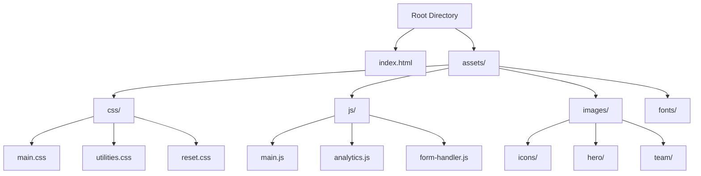
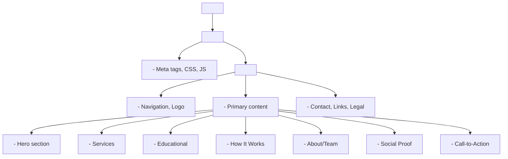
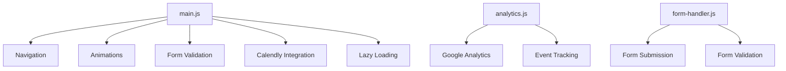
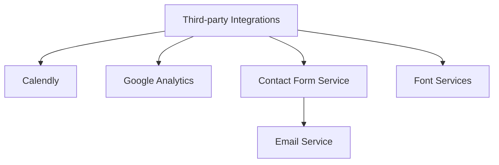

# Technical Architecture Plan for Architect Solutions Landing Page

This document outlines the complete technical architecture for the Architect Solutions landing page (https://architect.solutions), a consulting business that helps companies enable their in-house developers by implementing agentic coding and developing Modular Cognitive Processes (MCPs).

## Table of Contents
1. [File Structure](#file-structure)
2. [Responsive Design Approach](#responsive-design-approach)
3. [HTML Structure](#html-structure)
4. [CSS Organization](#css-organization)
5. [JavaScript Functionality](#javascript-functionality)
6. [Third-party Integrations](#third-party-integrations)
7. [SEO Optimization](#seo-optimization)
8. [Accessibility Compliance](#accessibility-compliance)
9. [Performance Optimization](#performance-optimization)

## File Structure

The project will use the following file structure to maintain organization and separation of concerns:



### Key Points:
- HTML in the root directory for easy access
- Assets folder containing all non-HTML resources
- CSS divided into logical files for maintainability
- JavaScript modularized by function
- Images organized by purpose

## Responsive Design Approach

The landing page will use a **mobile-first** approach, which offers several benefits:
- Better performance on mobile devices
- Progressive enhancement
- Focus on essential content and functionality

### Breakpoints

The site will use the following breakpoints to ensure compatibility across common device sizes:

| Breakpoint Name | Width Range |
|-----------------|-------------|
| Small (Mobile)  | 0 - 639px   |
| Medium (Tablet) | 640px - 1023px |
| Large (Desktop) | 1024px - 1279px |
| Extra Large     | 1280px and above |

### Implementation

In the CSS files, the breakpoints will be implemented using media queries:

```css
/* Base styles (mobile) */
.element {
  width: 100%;
}

/* Medium screens and up */
@media (min-width: 640px) {
  .element {
    width: 50%;
  }
}

/* Large screens and up */
@media (min-width: 1024px) {
  .element {
    width: 33.333%;
  }
}
```

## HTML Structure

The HTML structure will use semantic elements for better SEO and accessibility:



### Base HTML Template

```html
<!DOCTYPE html>
<html lang="en">
<head>
    <meta charset="UTF-8">
    <meta name="viewport" content="width=device-width, initial-scale=1.0">
    <title>Architect Solutions | Enabling In-house Developers with Agentic Coding & MCPs</title>
    <meta name="description" content="Empower your development team with AI agents and modular cognitive processes for streamlined, intelligent workflows. Expert consulting for innovative businesses.">
    <!-- Additional meta tags -->

    <!-- CSS -->
    <link rel="stylesheet" href="assets/css/reset.css">
    <link rel="stylesheet" href="assets/css/utilities.css">
    <link rel="stylesheet" href="assets/css/main.css">

    <!-- Fonts -->
    <link rel="preconnect" href="https://fonts.googleapis.com">
    <link rel="preconnect" href="https://fonts.gstatic.com" crossorigin>
    <link href="https://fonts.googleapis.com/css2?family=Inter:wght@400;500;600&family=Montserrat:wght@700;800&display=swap" rel="stylesheet">

    <!-- Deferred JavaScript -->
    <script defer src="assets/js/main.js"></script>
</head>
<body>
    <!-- Skip link for accessibility -->
    <a href="#main-content" class="skip-link">Skip to main content</a>

    <header>
        <div class="container flex justify-between items-center py-4">
            <a href="/" class="logo">
                
            </a>

            <nav>
                <!-- Navigation links -->
            </nav>

            <button class="menu-toggle md:hidden" aria-expanded="false" aria-controls="mobile-menu">
                <span class="sr-only">Menu</span>
                <span class="hamburger"></span>
            </button>
        </div>
    </header>

    <main id="main-content">
        <section class="hero">
            <!-- Hero content with h1 heading -->
        </section>

        <section class="services">
            <h2>Services & Solutions</h2>
            <!-- Service cards/blocks -->
        </section>

        <section class="education">
            <h2>Why Agentic Coding & MCPs?</h2>
            <!-- Educational content -->
        </section>

        <section class="process">
            <h2>How It Works</h2>
            <!-- Process steps -->
        </section>

        <section class="about">
            <h2>About Us</h2>
            <!-- Team/expertise content -->
        </section>

        <section class="testimonials">
            <h2>What Our Clients Say</h2>
            <!-- Testimonials -->
        </section>

        <section class="cta">
            <h2>Ready to Transform Your Dev Team?</h2>
            <!-- Call to action content -->
        </section>
    </main>

    <footer>
        <!-- Footer content -->
    </footer>

    <!-- Additional scripts -->
    <script defer src="assets/js/analytics.js"></script>
    <script defer src="assets/js/form-handler.js"></script>
</body>
</html>
```

## CSS Organization

Since a utility-first approach (similar to Tailwind) is preferred, the CSS will be organized as follows:

### 1. CSS Files Structure

- **reset.css**: Normalizes browser defaults
- **utilities.css**: Contains utility classes
- **main.css**: Contains custom component styles not covered by utilities

### 2. Custom Properties for Theming

```css
:root {
  /* Colors */
  --color-primary: #3b82f6;
  --color-secondary: #10b981;
  --color-dark: #1f2937;
  --color-light: #f9fafb;
  --color-gray-100: #f3f4f6;
  --color-gray-200: #e5e7eb;
  --color-gray-300: #d1d5db;
  --color-gray-400: #9ca3af;
  --color-gray-500: #6b7280;
  --color-gray-600: #4b5563;
  --color-gray-700: #374151;
  --color-gray-800: #1f2937;
  --color-gray-900: #111827;

  /* Typography */
  --font-primary: 'Inter', sans-serif;
  --font-heading: 'Montserrat', sans-serif;

  /* Spacing scale */
  --space-1: 0.25rem;
  --space-2: 0.5rem;
  --space-3: 0.75rem;
  --space-4: 1rem;
  --space-5: 1.25rem;
  --space-6: 1.5rem;
  --space-8: 2rem;
  --space-10: 2.5rem;
  --space-12: 3rem;
  --space-16: 4rem;
  --space-20: 5rem;
  --space-24: 6rem;

  /* Border radius */
  --radius-sm: 0.125rem;
  --radius-md: 0.375rem;
  --radius-lg: 0.5rem;
  --radius-xl: 1rem;
  --radius-full: 9999px;
}
```

### 3. Utility Classes

The utilities.css file will include classes for:

- **Layout**: Flex, grid, positioning, display
- **Spacing**: Margin, padding
- **Typography**: Font size, weight, alignment, colors
- **Colors**: Background colors, text colors
- **Effects**: Shadows, opacity
- **Responsive utilities**: Show/hide based on breakpoints

Example of utilities:

```css
/* Display */
.block { display: block; }
.flex { display: flex; }
.grid { display: grid; }
.hidden { display: none; }

/* Flexbox */
.flex-row { flex-direction: row; }
.flex-col { flex-direction: column; }
.justify-start { justify-content: flex-start; }
.justify-center { justify-content: center; }
.justify-between { justify-content: space-between; }
.items-center { align-items: center; }

/* Spacing */
.p-0 { padding: 0; }
.p-1 { padding: var(--space-1); }
.p-2 { padding: var(--space-2); }
.p-4 { padding: var(--space-4); }
/* ... and so on for margins, padding variants */

/* Typography */
.text-sm { font-size: 0.875rem; }
.text-base { font-size: 1rem; }
.text-lg { font-size: 1.125rem; }
.text-xl { font-size: 1.25rem; }
.text-2xl { font-size: 1.5rem; }
/* ... font weights, alignments, etc. */

/* Colors */
.text-primary { color: var(--color-primary); }
.bg-light { background-color: var(--color-light); }
/* ... other color utilities */

/* Responsive utilities */
@media (min-width: 640px) {
  .md\:flex { display: flex; }
  .md\:hidden { display: none; }
  /* ... other md: utilities */
}

@media (min-width: 1024px) {
  .lg\:flex { display: flex; }
  .lg\:hidden { display: none; }
  /* ... other lg: utilities */
}
```

### 4. Component Styles

For components that require custom styling beyond utilities:

```css
/* Hero section */
.hero {
  background: linear-gradient(135deg, var(--color-primary), var(--color-secondary));
  min-height: 80vh;
  position: relative;
}

/* Service cards */
.service-card {
  border-radius: var(--radius-lg);
  transition: transform 0.3s ease, box-shadow 0.3s ease;
}

.service-card:hover {
  transform: translateY(-5px);
  box-shadow: 0 10px 25px rgba(0, 0, 0, 0.1);
}

/* Process steps */
.process-step {
  position: relative;
  padding-left: 3rem;
}

.process-step::before {
  content: attr(data-step);
  position: absolute;
  left: 0;
  top: 0;
  width: 2rem;
  height: 2rem;
  border-radius: var(--radius-full);
  background-color: var(--color-primary);
  color: white;
  display: flex;
  align-items: center;
  justify-content: center;
  font-weight: bold;
}
```

## JavaScript Functionality

### Core JS Modules



### Key JavaScript Functionality:

#### 1. Navigation & Scrolling

```javascript
// Mobile navigation toggle
const menuToggle = document.querySelector('.menu-toggle');
const mobileMenu = document.querySelector('#mobile-menu');

menuToggle.addEventListener('click', () => {
  const expanded = menuToggle.getAttribute('aria-expanded') === 'true';
  menuToggle.setAttribute('aria-expanded', !expanded);
  mobileMenu.classList.toggle('hidden');
});

// Smooth scrolling to sections
document.querySelectorAll('a[href^="#"]').forEach(anchor => {
  anchor.addEventListener('click', function(e) {
    e.preventDefault();
    const targetId = this.getAttribute('href');
    document.querySelector(targetId).scrollIntoView({
      behavior: 'smooth'
    });
  });
});

// Active section highlighting
const observeSection = (section) => {
  const observer = new IntersectionObserver(
    (entries) => {
      entries.forEach((entry) => {
        const id = entry.target.getAttribute('id');
        const menuLink = document.querySelector(`nav a[href="#${id}"]`);
        if (entry.isIntersecting) {
          menuLink?.classList.add('active');
        } else {
          menuLink?.classList.remove('active');
        }
      });
    },
    { rootMargin: '-50% 0px -50% 0px' }
  );

  observer.observe(section);
};

document.querySelectorAll('section[id]').forEach(observeSection);
```

#### 2. Animations

```javascript
// Scroll-triggered animations
const animateOnScroll = () => {
  const elements = document.querySelectorAll('.animate-on-scroll');

  const observer = new IntersectionObserver(
    (entries) => {
      entries.forEach((entry) => {
        if (entry.isIntersecting) {
          entry.target.classList.add('animated');
          observer.unobserve(entry.target);
        }
      });
    },
    { threshold: 0.1 }
  );

  elements.forEach((element) => {
    observer.observe(element);
  });
};

document.addEventListener('DOMContentLoaded', animateOnScroll);
```

#### 3. Form Handling

```javascript
// Form validation and submission
const contactForm = document.getElementById('contact-form');

contactForm.addEventListener('submit', async (e) => {
  e.preventDefault();

  // Basic validation
  const email = document.getElementById('email');
  const emailError = document.getElementById('email-error');

  if (!isValidEmail(email.value)) {
    emailError.textContent = 'Please enter a valid email address';
    email.setAttribute('aria-invalid', 'true');
    return;
  }

  // Clear previous errors
  emailError.textContent = '';
  email.setAttribute('aria-invalid', 'false');

  // Prepare form data
  const formData = new FormData(contactForm);

  try {
    // Submit the form
    const response = await fetch('your-form-endpoint', {
      method: 'POST',
      body: formData,
    });

    if (response.ok) {
      // Show success message
      document.getElementById('form-success').classList.remove('hidden');
      contactForm.reset();
    } else {
      // Show error message
      document.getElementById('form-error').classList.remove('hidden');
    }
  } catch (error) {
    // Show error message
    document.getElementById('form-error').classList.remove('hidden');
    console.error('Form submission error:', error);
  }
});

function isValidEmail(email) {
  const regex = /^[^\s@]+@[^\s@]+\.[^\s@]+$/;
  return regex.test(email);
}
```

#### 4. Calendly Integration

```javascript
// Calendly widget initialization
function initCalendly() {
  Calendly.initInlineWidget({
    url: 'https://calendly.com/your-account/consultation',
    parentElement: document.getElementById('calendly-container'),
    prefill: {
      name: document.getElementById('name')?.value || '',
      email: document.getElementById('email')?.value || '',
    }
  });
}

// Initialize Calendly widget when the tab is clicked
document.querySelector('[data-tab="schedule"]')?.addEventListener('click', initCalendly);

// Track Calendly events
window.addEventListener('message', function(e) {
  if (e.data.event && e.data.event.indexOf('calendly') === 0) {
    // Track the event in analytics
    if (e.data.event === 'calendly.event_scheduled') {
      gtag('event', 'Consultation_Scheduled', {
        'event_category': 'Conversion',
        'event_label': 'Calendly'
      });
    }
  }
});
```

#### 5. Performance Optimizations

```javascript
// Lazy loading images
document.addEventListener('DOMContentLoaded', () => {
  const lazyImages = document.querySelectorAll('img[data-src]');

  if ('IntersectionObserver' in window) {
    const imageObserver = new IntersectionObserver((entries) => {
      entries.forEach((entry) => {
        if (entry.isIntersecting) {
          const image = entry.target;
          image.src = image.dataset.src;
          image.removeAttribute('data-src');
          imageObserver.unobserve(image);
        }
      });
    });

    lazyImages.forEach((image) => {
      imageObserver.observe(image);
    });
  } else {
    // Fallback for browsers that don't support IntersectionObserver
    lazyImages.forEach((image) => {
      image.src = image.dataset.src;
      image.removeAttribute('data-src');
    });
  }
});

// Deferred loading of non-critical resources
function loadDeferredStyles() {
  const stylesheets = document.querySelectorAll('link[rel="preload"][as="style"]');
  stylesheets.forEach((sheet) => {
    sheet.rel = 'stylesheet';
  });
}

// Load non-critical CSS after page load
if (window.requestIdleCallback) {
  window.requestIdleCallback(loadDeferredStyles);
} else {
  window.addEventListener('load', loadDeferredStyles);
}
```

## Third-party Integrations

### Integration Points



### Implementation Details

#### 1. Calendly Integration

```html
<!-- In the head section of the HTML file -->
<link href="https://assets.calendly.com/assets/external/widget.css" rel="stylesheet">
<script src="https://assets.calendly.com/assets/external/widget.js" defer></script>

<!-- In the body where the scheduling widget should appear -->
<div id="calendly-container" class="calendly-inline-widget" style="min-width:320px;height:580px;"></div>
```

```javascript
// In main.js or a dedicated calendly.js file
function initCalendly() {
  Calendly.initInlineWidget({
    url: 'https://calendly.com/your-account/consultation',
    parentElement: document.getElementById('calendly-container'),
    prefill: {
      name: document.getElementById('name').value,
      email: document.getElementById('email').value,
    }
  });
}
```

#### 2. Google Analytics

```html
<!-- In the head section of index.html -->
<script async src="https://www.googletagmanager.com/gtag/js?id=G-XXXXXXXXXX"></script>
<script>
  window.dataLayer = window.dataLayer || [];
  function gtag(){dataLayer.push(arguments);}
  gtag('js', new Date());
  gtag('config', 'G-XXXXXXXXXX');
</script>
```

```javascript
// In analytics.js, track custom events
function trackEvent(category, action, label) {
  if (typeof gtag === 'function') {
    gtag('event', action, {
      'event_category': category,
      'event_label': label
    });
  }
}

// Track CTA button clicks
document.querySelectorAll('.cta-button').forEach(button => {
  button.addEventListener('click', () => {
    trackEvent('Engagement', 'CTA_Click', button.textContent);
  });
});

// Track form submissions
document.getElementById('contact-form').addEventListener('submit', () => {
  trackEvent('Conversion', 'Form_Submit', 'Contact Form');
});
```

#### 3. Contact Form

```html
<!-- Contact form HTML -->
<form id="contact-form" action="#" method="POST">
  <div class="form-group">
    <label for="name">Name</label>
    <input type="text" id="name" name="name" required aria-required="true">
    <div id="name-error" class="error-message" aria-live="polite"></div>
  </div>

  <div class="form-group">
    <label for="email">Email</label>
    <input type="email" id="email" name="email" required aria-required="true">
    <div id="email-error" class="error-message" aria-live="polite"></div>
  </div>

  <div class="form-group">
    <label for="message">Message</label>
    <textarea id="message" name="message" rows="4" required aria-required="true"></textarea>
    <div id="message-error" class="error-message" aria-live="polite"></div>
  </div>

  <button type="submit" class="cta-button">Send Message</button>

  <div id="form-success" class="success-message hidden">Thank you! Your message has been sent.</div>
  <div id="form-error" class="error-message hidden">There was an error submitting the form. Please try again.</div>
</form>
```

```javascript
// In form-handler.js
document.getElementById('contact-form').addEventListener('submit', function(e) {
  e.preventDefault();

  // Form validation logic here...

  const formData = new FormData(this);

  fetch('https://your-form-endpoint.com', {
    method: 'POST',
    body: formData,
  })
  .then(response => response.json())
  .then(data => {
    // Success handling
    document.getElementById('form-success').classList.remove('hidden');
    this.reset();
  })
  .catch(error => {
    // Error handling
    document.getElementById('form-error').classList.remove('hidden');
    console.error('Form submission error:', error);
  });
});
```

## SEO Optimization

### Meta Tags

```html
<meta charset="UTF-8">
<meta name="viewport" content="width=device-width, initial-scale=1.0">
<title>Architect Solutions | Enabling In-house Developers with Agentic Coding & MCPs</title>
<meta name="description" content="Empower your development team with AI agents and modular cognitive processes for streamlined, intelligent workflows. Expert consulting for innovative businesses.">
<meta name="keywords" content="AI consulting, agentic coding, MCP development, developer enablement">

<!-- Open Graph / Social Media -->
<meta property="og:type" content="website">
<meta property="og:url" content="https://architect.solutions/">
<meta property="og:title" content="Architect Solutions | AI Agent Development Consulting">
<meta property="og:description" content="Transform your dev team into an AI innovation engine with agentic coding and modular cognitive processes.">
<meta property="og:image" content="https://architect.solutions/assets/images/og-image.jpg">

<!-- Twitter -->
<meta name="twitter:card" content="summary_large_image">
<meta property="twitter:domain" content="architect.solutions">
```

### Structured Data

```html
<script type="application/ld+json">
{
  "@context": "https://schema.org",
  "@type": "ProfessionalService",
  "name": "Architect Solutions",
  "url": "https://architect.solutions",
  "logo": "https://architect.solutions/assets/images/logo.png",
  "description": "Consulting services for implementing agentic coding and developing Modular Cognitive Processes (MCPs).",
  "address": {
    "@type": "PostalAddress",
    "addressLocality": "[City]",
    "addressRegion": "[Region]",
    "addressCountry": "[Country]"
  },
  "telephone": "[Phone]",
  "email": "contact@architect.solutions",
  "serviceType": ["AI Consulting", "Developer Enablement", "MCP Development"]
}
</script>
```

### Sitemap & Robots.txt

Create a sitemap.xml file in the root directory:

```xml
<?xml version="1.0" encoding="UTF-8"?>
<urlset xmlns="http://www.sitemaps.org/schemas/sitemap/0.9">
  <url>
    <loc>https://architect.solutions/</loc>
    <lastmod>2025-04-08</lastmod>
    <changefreq>monthly</changefreq>
    <priority>1.0</priority>
  </url>
  <!-- Add other URLs if you have them -->
</urlset>
```

Create a robots.txt file in the root directory:

```
User-agent: *
Allow: /
Sitemap: https://architect.solutions/sitemap.xml
```

## Accessibility Compliance

### Key Implementation Points

- Semantic HTML structure
- ARIA attributes where necessary
- Sufficient color contrast (minimum 4.5:1 for normal text)
- Keyboard navigation support
- Focus states for interactive elements
- Alternative text for images
- Skip-to-content link

### Example Implementations

```html
<!-- Skip to content link -->
<a href="#main-content" class="skip-link">Skip to main content</a>

<!-- ARIA for interactive elements -->
<button aria-expanded="false" aria-controls="mobile-menu" class="menu-toggle">
  <span class="sr-only">Menu</span>
  <span class="hamburger"></span>
</button>

<!-- Form field accessibility -->
<label for="name">Name</label>
<input type="text" id="name" name="name" required aria-required="true">
<div id="name-error" class="error-message" aria-live="polite"></div>

<!-- Image accessibility -->


<!-- Screen reader only text -->
<span class="sr-only">Opens in a new tab</span>

<!-- Accessible color contrast -->
<style>
  :root {
    --color-primary: #2563eb; /* Ensures good contrast with white text */
  }

  .button {
    background-color: var(--color-primary);
    color: white;
    /* At least 4.5:1 contrast ratio */
  }
</style>
```

### CSS for Accessibility

```css
/* Skip link */
.skip-link {
  position: absolute;
  top: -40px;
  left: 0;
  background: var(--color-primary);
  color: white;
  padding: 8px;
  z-index: 100;
}

.skip-link:focus {
  top: 0;
}

/* Screen reader only */
.sr-only {
  position: absolute;
  width: 1px;
  height: 1px;
  padding: 0;
  margin: -1px;
  overflow: hidden;
  clip: rect(0, 0, 0, 0);
  white-space: nowrap;
  border-width: 0;
}

/* Focus styles */
a:focus, button:focus, input:focus, textarea:focus, select:focus, [tabindex]:focus {
  outline: 2px solid var(--color-primary);
  outline-offset: 2px;
}
```

## Performance Optimization

### Key Strategies

#### 1. Image Optimization

- Use WebP format with fallbacks
- Responsive images with srcset
- Lazy loading

```html
<!-- Responsive images -->


<!-- Fallback for browsers that don't support WebP -->
<picture>
  <source srcset="assets/images/service-1.webp" type="image/webp">
  
</picture>
```

#### 2. CSS Optimization

- Critical CSS inline in the head
- Remaining CSS loaded asynchronously
- Minification and compression

```html
<!-- Critical CSS inline -->
<style>
  /* Critical styles for above-the-fold content */
  body { font-family: 'Inter', sans-serif; margin: 0; }
  .hero { /* Hero styles */ }
  /* More critical styles... */
</style>

<!-- Asynchronously load non-critical CSS -->
<link rel="preload" href="assets/css/main.css" as="style" onload="this.onload=null;this.rel='stylesheet'">
<noscript><link rel="stylesheet" href="assets/css/main.css"></noscript>
```

#### 3. JavaScript Optimization

- Code splitting
- Defer non-critical scripts
- Minification and compression

```html
<!-- Defer non-critical scripts -->
<script defer src="assets/js/main.js"></script>
<script defer src="assets/js/analytics.js"></script>
<script defer src="assets/js/form-handler.js"></script>

<!-- Async for third-party scripts -->
<script async src="https://www.googletagmanager.com/gtag/js?id=G-XXXXXXXXXX"></script>
```

#### 4. Resource Hints

```html
<link rel="preconnect" href="https://fonts.googleapis.com">
<link rel="preconnect" href="https://www.google-analytics.com">
<link rel="preconnect" href="https://calendly.com">

<link rel="preload" href="assets/fonts/inter-var.woff2" as="font" type="font/woff2" crossorigin>
<link rel="preload" href="assets/images/hero-mobile.webp" as="image" media="(max-width: 639px)">
```

#### 5. Caching Strategy

```html
<meta http-equiv="Cache-Control" content="max-age=31536000">
```

```
# .htaccess for Apache servers
<IfModule mod_expires.c>
  ExpiresActive On

  # Images
  ExpiresByType image/jpeg "access plus 1 year"
  ExpiresByType image/png "access plus 1 year"
  ExpiresByType image/webp "access plus 1 year"
  ExpiresByType image/svg+xml "access plus 1 year"

  # CSS, JavaScript
  ExpiresByType text/css "access plus 1 month"
  ExpiresByType text/javascript "access plus 1 month"
  ExpiresByType application/javascript "access plus 1 month"

  # Fonts
  ExpiresByType font/woff "access plus 1 year"
  ExpiresByType font/woff2 "access plus 1 year"
</IfModule>
```

This comprehensive technical architecture plan provides a solid foundation for implementing the Architect Solutions landing page. Following these guidelines will ensure the creation of a high-performance, responsive, accessible, and SEO-optimized landing page that effectively communicates the value proposition of Architect Solutions.
